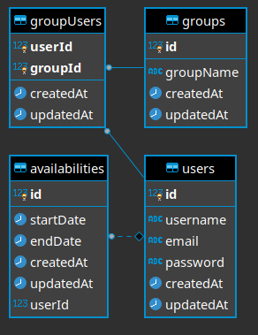

# MeetMore-server

## [Check out the deployed version here!](https://meetmore.netlify.app/)
##### Test account details
email address: harry@potter.com
password: 123

## What this project is about
This is server-side for a full-stack application that I built, demonstrating my understanding of NodeJS, ExpressJS, Sequelize and PostgreSQL.

## Table of contents
- **[Data model for this project](#data-model-for-this-project)**
- **[Technologies used](#technologies-used)**
- **[Client-side repository](#client-side)**

## Data model for this project

## Technologies used
#### Click links to view some code samples in this project
- **[Express](./User/router.js)**
- **[Sequelize](./Availability/router.js)**
- **[Bcrypt/JWT](./auth/authMiddleware.js)**

*Checkout the client-side repository [here](https://github.com/Laphatradap/MeetMore-client).*
